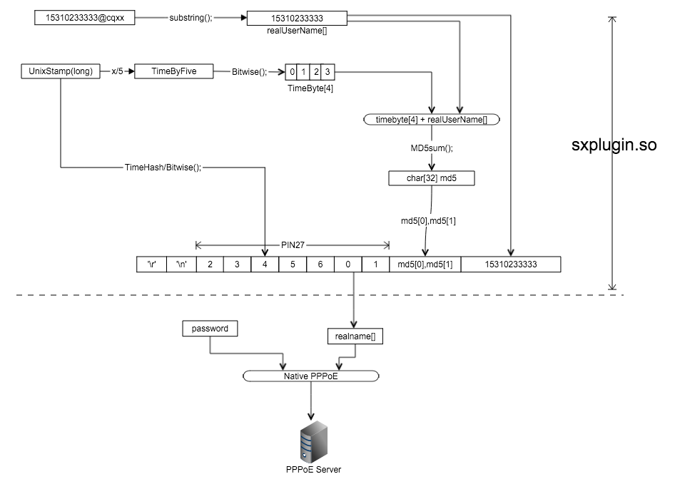

# Openwrt-NetKeeper 闪讯拨号for OpenWrt


### 简述

这是一个基于OpenWRT的闪讯拨号算法的实现。通过对Android版的反编译，获得到了拨号流程，并把它移植到OpenWRT上运行，~~实现打破毒瘤电信垄断的效果~~。

论坛见[这里](http://www.right.com.cn/forum/thread-141979-1-1.html)

~~QQ群在这里495772016~~


心跳已经通过Android版反编译出来了，不过应该是烂尾了，找工作没时间移植了（用脚本语言发套接字就可以）.... <https://github.com/miao1007/android-netkeeper>


### 工作原理


### 支持地区
1. 武汉E信
2. 重庆
3. 杭州
4. 南昌(V18~V32)
5. 海南
6. 青海/新疆
7. 河北
8. 山东移动

查看更多： [supported radius](https://github.com/miao1007/Openwrt-NetKeeper/blob/master/src/makefile#L10)

### 特性
1. 算法非常有效率，基于位运行优化，嵌入式设备也能轻松运行；
2. 可移植强，仅有的几个库文件在任何设备均可使用；
3. 自适应帐号长度，支持带后缀与不带后缀的运算；
4. 支持原厂OpenWrt、PandoraBox（但并不推荐）。


## 如何使用


#### 1. 下载最新版插件

1. [sxplugin.so](https://github.com/miao1007/Openwrt-NetKeeper/releases)
2. [confnetwork.sh](https://github.com/miao1007/Openwrt-NetKeeper/blob/master/src/confnetwork.sh)
 
下载后，修改`confnetwork.sh`中的 `pppd_options` `username ` `password ` 


#### 2. 上传
使用scp(windows下可以使用 [WinScp](https://winscp.net/download/winscp576.zip)) 上传

```
yourprovince_sxplugin.so -> /usr/lib/pppd/2.4.7/
confnetwork.sh -> /tmp/
```

#### 3. 配置路由器
登陆路由器，执行脚本

```
chmod a+x /tmp/confnetwork.sh
sh /tmp/confnetwork.sh 
```

最后在浏览器中同步一下路由器时间并重连一下闪讯(netkeeper)


## 开发
以下需要了解开发相关技术

### 1. 用源码进行编译

首先你要准备一个Ubuntu的虚拟机(recommend [14.04](http://releases.ubuntu.com/14.04/)) 作为开发依赖

#### 1.1. 克隆代码

```
git clone --depth=1 https://github.com/miao1007/Openwrt-NetKeeper.git
```

#### 1.2. 下载Toolchain

直接下载最新的[Toolchain](https://github.com/miao1007/Openwrt-NetKeeper/wiki#2-%E5%A6%82%E4%BD%95%E4%B8%8B%E8%BD%BDgcc)
	
或者用命令下载
	
```
#this is a sample for mipsel(Little Endian) device
wget https://downloads.openwrt.org/barrier_breaker/14.07/ramips/mt7620a/OpenWrt-Toolchain-ramips-for-mipsel_24kec%2bdsp-gcc-4.8-linaro_uClibc-0.9.33.2.tar.bz2 | tar -xjf 
```

#### 1.3. 配置

仔细阅读 `makefile` 与 `confnetwork.sh` 中的 **TODO**

#### 1.4. 编译
	

```
cd Openwrt-NetKeeper/src/
make all
```

### 2. 配置路由器

使用此脚本自动配置路由器

```
make upload
```

## 疑难问题

1. 请先在[wiki](https://github.com/miao1007/Openwrt-NetKeeper/wiki)中查找答案
2. 提交新的[issue](https://github.com/miao1007/Openwrt-NetKeeper/issues/new) （请附上系统日志）


## 感谢
* [NETKEEPER ON WINDOWS](http://www.purpleroc.com/html/507231.html)
* [CQUPT NETKEEPER](http://bbs.cqupt.edu.cn/nForum/#!article/Unix_Linux/13624)
* <https://sunflyer.cn/archives/239>

## 作者
Leon - <miao1007@gmail.com>


## License

1. GPL
2. 勿做**TAOBAO**用途
